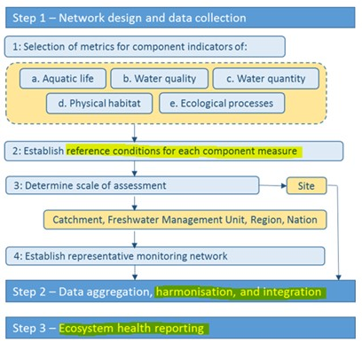
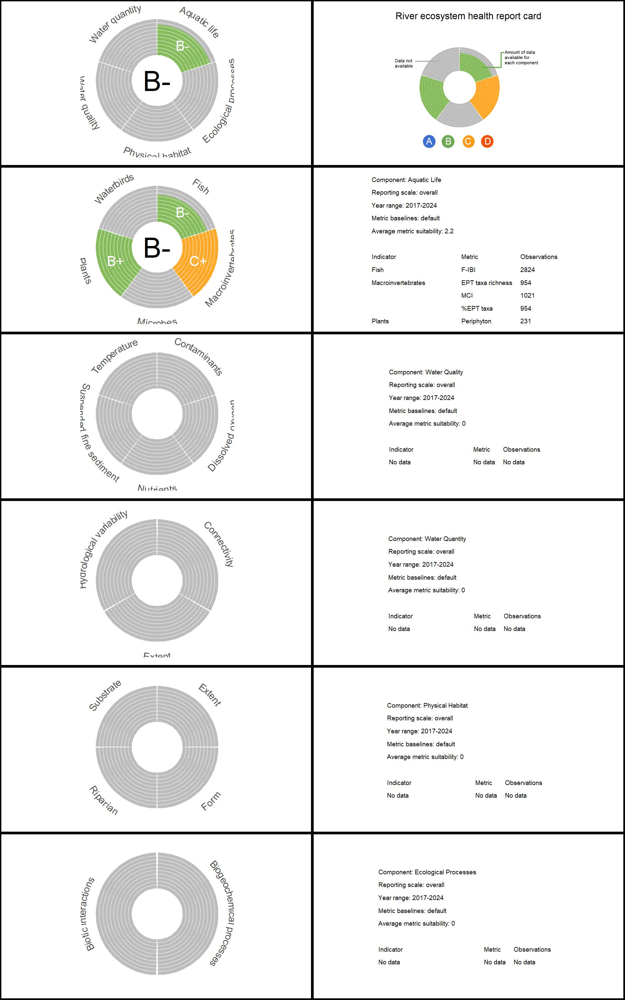

<!-- README.md is generated from README.Rmd. Please edit that file -->

```{r, include = FALSE}
knitr::opts_chunk$set(
  collapse = TRUE,
  comment = "#>",
  fig.path = "man/figures/README-",
  out.width = "100%"
)
```

# riverhealth

<!-- badges: start -->
This document outlines the process for using a R package to calculate the New Zealand River Ecosystem Health Score, as proposed by Clapcott et al. (2019). The score serves as a simple and holistic measure of the biophysical condition of rivers and streams in New Zealand. It is based on the Freshwater Biophysical Ecosystem Health Framework and evaluates five core components of ecosystem health: *Aquatic Life*, *Physical Habitat*, *Water Quality*, *Water Quantity*, and *Ecological Processes*.
<!-- badges: end -->


## Installation

You can install the development version of riverhealth from [GitHub](https://github.com/) with:

``` r
# install.packages("devtools")
devtools::install_github("cawthron/riverhealth")
```

## Preparing data 

Before using `riverhealth`, it is assumed that users have followed the steps required to apply the Freshwater Biophysical Ecosystem Health Framework (Figure 1). This package assists users in **Step 1** by providing default reference values for metrics, in **Step 2** by harmonising and integrating data, and in **Step 3** by calculating performance scores and plots for ecosystem health reporting. Users must complete other steps in the process before using this tool. Such as the establishment of representative monitoring sites, data collection, metric calculation, and data aggregation to a chosen spatial and temporal scale (e.g., the calculation of a 5-yr median for a given site).



### Reference table

A nationally applicable reference table is provided with the package. This table provides default values for excellent ecological condition (minimum human impact) as well as for poor ecological condition (e.g., national bottom lines) for metrics against which sites are compared with to calculate performance scores. The reference table was populated using best available information.

For attributes in the National Policy Statement for Freshwater Management (NPSFM) 2020, the default values are provided in Tables in Appendix 2A and 2B. In this tool, the metric value denoting an A band was used for excellent condition and the metric value denoting the national bottom line was used for poor condition. Exceptions include: Dissolved reactive phosphorus and Fish Index of Biotic Integrity, where the metric value denoting the D band was used for poor condition; Ecosystem metabolism (both gross primary production and ecosystem respiration) default values were informed by Young et al. (2008) and STAG Report to the Minister for the Environment (2019). For attributes not in the NPSFM, the references used to inform default guidelines values can be found in the Appendix.

We recommend using the reference table provided with the package. The default reference table is included with the package and can be accessed once the package is installed as `reference_table_default`:

```{r, echo=FALSE, warning=FALSE, message=FALSE}
library(riverhealth)

kableExtra::kable(reference_table_default)  

```

Each row corresponds to a different metric and each column denotes:

- **component:**  Each component describes a different aspect of freshwater biophysical ecosystem health.
- **indicator:** Within a component, indicators aggregate similar metrics. This column denotes the indicator to which a given metric belongs to.
- **attribute:** The biophysical attributes a given metric aims to quantify. The attribute classification often matches the metric classification, but it can vary when multiple metrics measure the same attribute(e.g., both the *do_7_day_min* and *do_1_day_min* metrics measure the *dissolved oxygen* attribute).
- **metric:** Measured or modeled biophysical characteristics of rivers and streams.
- **class:** The category used for calculating metric performance scores (e.g., productive/default, sediment class). Different categories will have different benchmarks.
- **bottom_line:** This numerical value is a benchmark that denotes a degraded state or poor condition for a given metric, against which sites will be compared to calculate performance scores.
- **bottom_line_range:** For non-linear metrics only, these values denote the range that comprises a degraded state for a given metric. If the metric is linear, then this column should be NA.
- **reference:** This numerical value is a benchmark that denotes a healthy state or excellent condition for a given metric, against which sites will be compared to calculate performance scores.
- **reference_line_range:** For non-linear metrics only, these values denote the range that comprises a healthy state for a given metric. If the metric is linear, then this column should be NA.
- **cut:** For NPSFM metrics, this numerical value is the benchmark that denotes metric grades between the **bottom_line** and the **reference** values (e.g., delineating B/C grades). These values are only used to calculate NPSFM grade bands and are not used to calculate metric performance scores.
- **healthy_value:** A categorical value that denotes whether high or low values of a metric indicate a healthy stream. Categories are *high*, *low*, or *non-linear*.
- **NPSFM:** A Boolean variable (*TRUE* or *FALSE*) denoting if a metric is part of the National Policy Statement for Freshwater Management 2020.
- **suitability:** A numerical value (*1*, *2*, or *3*) for each metric, assigned using expert assessment to quantify if metrics are fit for purpose. These values are used in the data integration process.
- **key_metric:** A Boolean variable denoting if a metric is necessary for a holistic assessment of a river or stream. Metrics denoted as key metrics will be used to calculate plotting ratios of each indicator.

If the user needs to apply different benchmarks (e.g., to account for regional guideline values or spatial variation), they can use their own user-defined reference table. However, a user-defined reference table must follow the exact same format as the default reference table. The final output will indicate whether the default or user-defined benchmarks were used. We recommend the user employ best practice guidelines to inform alternative benchmarks, such as those used in Clapcott et al (2019).

A note on metric **suitability** values. In the default reference table, these were assigned using the following logic: All metrics with tables in Appendix 2A and 2B of the NPSFM 2020 were assigned a 3, indicating high suitability. Metrics with standardised methods and/or national datasets and/or national guideline values were assigned a 2, indicating medium suitability. Remaining metrics that did not meet the above definitions or only provided partial assessment of an indicator compared to an alternative metric (e.g., *taxa_richness* compared to *fish_ibi*) were assigned a 1, indicating low suitability. 

A note on **key_metric** identification. Metrics were labelled as key metrics if they contributed to a holistic assessment of ecological integrity, which includes nativeness, pristineness, diversity, and resilience, where applicable. Each indicator must contain at least one key metric even if that metric has low suitability. For example, plant *exotic_species* is a key metric despite a suitability of 1 because there are no alternative metrics assessing nativeness.

### Preparing data – Indicator tables

Within each component, indicator tables should be prepared independently. Each table should be presented as a tidy data frame, where each variable constitutes a column, and each observation forms a row. The data in these tables should already be aggregated at the desired level for analysis. For example, as detailed in Clapcott et al. (2019), data were aggregated at the site level using the mean average for the given period (e.g. 2013-2017).

Each indicator table must include the following columns:

- **site:** The unique identifier for the spatial scale at which observations were aggregated (e.g. NZSegment, Site name).
- **class:** The category of a given site in the context of the metrics being measured  (e.g. productive/default for *periphyton*, sediment class for *visual_clarity*).
-	**indicator:** This column denotes the indicator to which the given metrics belong to. Values in this column should be an exact match to the indicators listed in the **Reference Table**.
- **component:** This column denotes the component to which the given metric/s belong to. Values in this column should be an exact match to the components listed in the **Reference Table**.
-	**reporting_scale:** The chosen scale for data integration. This could be, for example, Freshwater Management Unit, region, or stream class. This column should be the same for all indicator tables for calculating an ecosystem health score. The names for all reporting scales should be consistent across all indicator tables.
-	**individual metric columns:** Each metric observed or modelled should have its own column, containing the respective metric values for evaluating the indicator. At least one metric column is required. Column names should be an exact match to the metrics listed in the **Reference Table** (eg., *fish_ibi*, *qmci*).

As an example, all subsequent analyses will show how to calculate health scores for the  *Aquatic Life* component using simulated data. This data is provided with the package. The first few rows of the `macroinvertebrates` indicator table show:


```{r, echo=FALSE, warning=FALSE, message=FALSE}

kableExtra::kable(head(macroinvertebrates))

```

The order of the columns will not affect the analyses. However, all the required columns should be present within each indicator table.

Following the *Aquatic Life* example, we also simulated data for the `fish` indicator:

```{r, echo=FALSE, warning=FALSE, message=FALSE}

kableExtra::kable(head(fish))

```

And finally, the `plants` indicator:

```{r, echo=FALSE, warning=FALSE, message=FALSE}


kableExtra::kable(head(plants))

```

Note that it is not necessary to have *all* indicator tables that make up a component to perform the subsequent analyses. Analyses can be performed with a minimum of one metric measured and one indicator table. 

## Ecosystem health analyses

Before conducting analyses, two global options must be defined, which will apply to all components. The first option, `NPSFM`, is a Boolean variable. When set to `TRUE`, it exclusively calculates indicator, component, and overall river health scores for metrics outlined in the 2020 National Policy Statement for Freshwater Management.

The second option, `overall_score`, is also a Boolean variable. When set to `TRUE`, it computes a single indicator, component, and overall river health score. Otherwise, calculations are performed for individual groups listed in the `reporting_scale` column. 

```{r, echo=TRUE, warning=FALSE, message=FALSE}

npsfm_only <- FALSE
overall_score <- TRUE

```


### Data harmonisation

Data harmonisation involves converting data to a common scale. This is done so 
that disparate metrics can combined at indicator and component levels.

Following Clapcott et al. (2019), data harmonisation involved calculating performance scores for each metric.  These performance scores range from 0 to 1, where 0 signifies a degraded condition (e.g., the bottom line), and 1 indicates a minimally-impacted reference condition. Sites performing better than the reference target cannot achieve scores higher than 1, and those performing worse than the bottom line cannot score less than 0.

Where low values of a metric indicate a healthy performance, as indicated by the *healthy_value* in the **Reference table** performance scores are calculated as:

<!-- $$\text{ps}_{i,c,m} = \text{min(}1,\text{max(}\frac{\text{bl}_{c,m} - \text{value}_{i,m}}{\text{bl}_{c,m} - \text{ref}_{c,m}}\text{))}$$ -->

`$\text{ps}_{i,c,m} = \min \left( 1, \max \left( \frac{\text{bl}_{c,m} - \text{value}_{i,m}}{\text{bl}_{c,m} - \text{ref}_{c,m}} \right) \right)$`


Where $\text{ps}_{i,c,m}$ denotes the performance score for site $i$ belonging to class $c$ and metric $m$, $\text{bl}_{c,}$ and $\text{ref}_{c,m}$ represent the metric-specific bottom line and reference values for class $c$ respectively, while $\text{value}_{i,m}$ stands for the measured or modeled value of metric $m$ in site $i$.


In contrast, where high values of a metric indicate a healthy performance,  as indicated by the *healthy_value* in the **Reference table**, performance scores for each site are calculated as:

$$
\text{ps}_{i,c,m} = \text{min(}1,\text{max(}\frac{\text{value}_{i,m} - \text{bl}_{c,m} }{  \text{ref}_{c,m} - \text{bl}_{c,m}}\text{))}
$$

### Data integration

Data integration involves combining different metric performance scores into a
combined assessment (i.e. into an indicator, component and overall river ecosystem
health score). To do so, weighted averaging is applied based on data suitability scores to integrate
metric scores. Suitability scores (*1*, *2* or *3*) for each metric are provided with the **Reference table**. A score of *3* indicates the data is of high quality, whereas a score of *1* indicates the data is less accurate and should have less weight.

Indicator scores are  calculated based on all available metric performance scores and weighted by metric-associated suitability scores. Formally, indicator scores, ($I$), can be calculated as:

$$
\text{I} = \frac{\sum_{m=1}^{p} \frac{1}{n} \sum_{i=1}^{n}\text{ps}_{i,m}  S_{m}}{\sum_{m=1}^{p} S_{m}}
$$

In this equation, $p$ represents the total number of metrics that comprise an indicator, with $m$ iterating through each metric. Meanwhile $n$ denotes the total number of sites (observations) per metric, and $ps_{i}$ represents the performance score of site $i$. Finally, $S_{m}$ is the suitability score for metric $m$.  In simpler terms, this equation computes a weighted average of the average values within each metric, where the weights are determined by $S_{m}$. Indicator scores can be calculated for all sites (i.e., an *overall* score) or independently for each group in the *reporting_scale* column.

Importantly, if two metrics measure the same attribute, then only the metric with the lowest average performance score will be taken into account to calculate $I$. This is done to avoid over-reporting of the similar data.

Suitability-weighted average scores are also used in the calculation of component scores in a similar fashion to indicator scores. Data harmonisation and integration can be easily done using the function `calculate_health_score`. To use this function, indicator tables must be provided as a list:

```{r, echo=TRUE, warning=FALSE, message=FALSE}
indicators <- list(macroinvertebrates,
                   fish,
                   plants)

score_table <- calculate_health_score(indicators = indicators,
                                      reference_table = reference_table_default,
                                      overall_score = overall_score,
                                      npsfm_only = npsfm_only)

kableExtra::kable(score_table)

```

The results of this function yield a table where each row is a unique combination of *metric* and *reporting_scale*. If `overall = TRUE` then groups in *reporting_scale* are ignored and scores are calculated for all sites. The new columns in this table denote:

- **metric_score:** The average metric performance score for a given reporting scale
- **indicator_score:** The results of data integration at the indicator level. Note that if all suitability scores are the same for all metrics, then the indicator score shows the average performance scores of all metrics that comprise an indicator. Since the data is shown per metric, rows belonging to the same indicator will have repeated values for this column.
- **indicator_grade:** This column shows the grade assigned to each indicator score as shown in Clapcott et al. (2019).
- **component_score:** The results of data integration at the component level. Similar to the **indicator_score** column, if all suitability scores are the same, then this column will show the average performance score for all metrics that comprise a component.
- **component_grade:**  This column shows the grade assigned to a component based on its  score as shown in Clapcott et al. (2019).
- **observations:** This column denotes the  number of observations per metric and reportinc scale used to calculate performance scores.
- **default_baselines:** This column denotes if default baselines were used (`TRUE`) or if user defined baselines were used (`FALSE`) to calculate preformance scores.

Note on **grade** assignment. There are six possible grades assigned based on the division of performance scores between 0 and 1 as follows: 0 (*D*), 0 > and < 0.25 (*C-*), 0.25 > and < 0.5 (*C+*), 0.5 >  and < 0.75 (*B-*), 0.75 > and < 1 (*B+*) and 1 (*A*).

## Ecosystem health reporting

The package also offers convenient functions to visualise and report the results of the river ecosystem health analyses.

### Component plot

To visualize the health scores within a component, the results from the function `calculate_health_score` have to be given to the `plot_component` function as follows: 

```{r echo=TRUE, message=FALSE, warning=FALSE, fig.width = 18,height=9}
component_plot <- plot_component(
  score_table = score_table,
  npsfm_only = npsfm_only,
  reference_table = reference_table_default,
  font_size = 20,
  color_table = NULL,
  start_year = 2017,
  end_year = 2024
  
)

component_plot
```

The output of the `plot_component` function is a list of plots, where each element corresponds to a different *reporting_scale* group.

The left panel is a doughnut plot where each wedge represents a different indicator, as shown in the labels. The center of the doughnut plot shows the component health score as a grade, and each wedge displays the indicator health scores as grades. Different colors denote different grades. If the user wishes to use a different color palette than the one provided with the package, they should provide a `color table` (see help for `plot_component`).

Each wedge is filled to denote data availability. To calculate how much each wedge should be filled, the function calculates the availability for each indicator, $\text{A}_{I}$, as:

$$
\text{A}_{I} = \frac{\sum_{m=1}^{p}    S_{m}}{\sum_{k=1}^{n} S_{k}}
$$

Where $S_{m}$ denote metrics measured by the user and $S_{k}$ denote *key_metrics* for a given indicator, as shown in the **Reference table**.

The right panel shows a metadata table for the plotted results, including the component the metrics belong to, the reporting scale being plotted, the mean suitability for all metrics, and the number of observations per metric. The *Year range* row is a numeric value input by the user to the `plot_component` function to specify the temporal scale of observations. The *Metric baselines* row indicates whether the reference table provided by the user is the same as the one provided by the package (*default*) or if the user defined different benchmarks (*user defined*).

### River ecosystem report card

The package also provides a function to visualize a report card on the state of all five core components of ecosystem health as well as an overall assessment of river health.

To produce this report card the user must input the outputs of the `calculate_health_score` function for all the components available as a list. In the present example, only the *Aquatic Life* component is present:

```{r echo=TRUE, message=FALSE, warning=FALSE, out.width='100%', out.height='400px'}

component_scores <- list(score_table)

report_card <- plot_report_card(
  component_scores = component_scores,
  reference_table = reference_table_default,
  npsfm_only = npsfm_only,
  start_year = 2017,
  end_year = 2024,
  color_table = NULL,
  font_size = 14
  
)


#save it to aid visualization
jpeg("./aquatic_life_plot.jpeg",width = 1875, height = 3000, res = 150)
report_card[[1]]
dev.off()


```
Similar to the `plot_component` function, the `plot_all_components` output is a list of plots, one per group in the *reporting_scale* column. We recommend saving the outputs of this function as individual pdf files to aid visualization, as shown in the code above.

{width=100%}

## Extra functionality – NPSFM grades

The package offers the option to calculate metric grades based on the 2020 National Policy Statement for Freshwater Management benchmarks. However, these grades are not used for data integration as they are metric-specific and cannot be integrated into indicator and component levels. To calculate metric grades, all indicator tables within a component should be put in a list and given to the function `calculate_npsfm_grade` as follows:


```{r, echo=TRUE, warning=FALSE, message=FALSE}
indicators <- list(fish,macroinvertebrates,plants)

npsfm_grades <- calculate_npsfm_grade(indicators = indicators,
                                      reference_table = reference_table_default,
                                      overall = overall_score)

kableExtra::kable(npsfm_grades)

```

The output of the `calculate_npsfm_grade` function is a table where each row is a unique combination of *metric*, *class*, and *reporting_scale*. The new additional columns of this table denote:

- **metric_mean:** The average value of a metric for a particular class and reporting scale.
- **npsfm_grade:** The NPSFM grade band that corresponds to a metric given its average value.

**The Cauchy-Schwarz Inequality**
$$\left( \sum_{k=1}^n a_k b_k \right)^2 \leq \left( \sum_{k=1}^n a_k^2 \right) \left( \sum_{k=1}^n b_k^2 \right)$$
