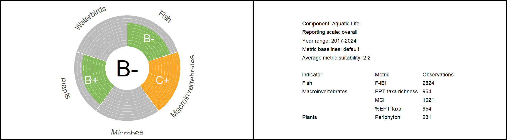
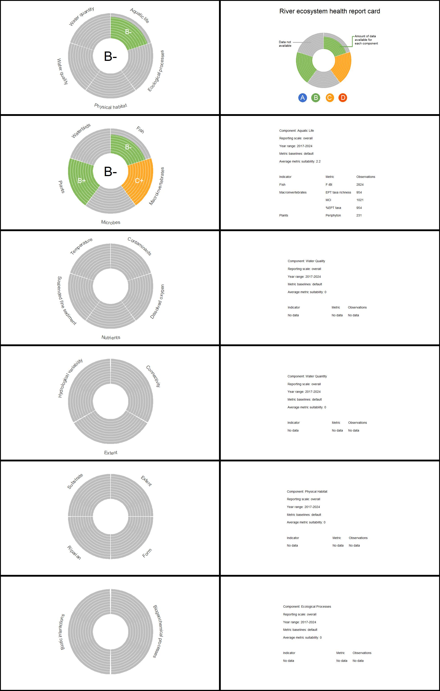

<!-- README.md is generated from README.Rmd. Please edit that file -->

# riverhealth

<!-- badges: start -->

This document outlines the process for using a R package to calculate
the New Zealand River Ecosystem Health Score, as proposed by Clapcott et
al. (2019). The score serves as a simple and holistic measure of the
biophysical condition of rivers and streams in New Zealand. It is based
on the Freshwater Biophysical Ecosystem Health Framework and evaluates
five core components of ecosystem health: *Aquatic Life*, *Physical
Habitat*, *Water Quality*, *Water Quantity*, and *Ecological Processes*.
<!-- badges: end -->

## Installation

You can install the development version of riverhealth from
[GitHub](https://github.com/) with:

``` r
# install.packages("devtools")
devtools::install_github("mfe-nz/riverhealth")
```

## Preparing data

Before using `riverhealth`, it is assumed that users have followed the
steps required to apply the Freshwater Biophysical Ecosystem Health
Framework (Figure 1). This package assists users in **Step 1** by
providing default reference values for metrics, in **Step 2** by
harmonising and integrating data, and in **Step 3** by calculating
performance scores and plots for ecosystem health reporting. Users must
complete other steps in the process before using this tool. Such as the
establishment of representative monitoring sites, data collection,
metric calculation, and data aggregation to a chosen spatial and
temporal scale (e.g., the calculation of a 5-yr median for a given
site).

<figure>

<figcaption aria-hidden="true">Figure 1 Flow diagram of the steps in the
application of the framework for freshwater ecosystem health (from
Clapcott et al. 2019) with steps undertaken by this R package
highlighted.</figcaption>
</figure>

### Reference table

A nationally applicable reference table is provided with the package.
This table provides default values for excellent ecological condition
(minimum human impact) as well as for poor ecological condition (e.g.,
national bottom lines) for metrics against which sites are compared with
to calculate performance scores. The reference table was populated using
best available information.

For attributes in the National Policy Statement for Freshwater
Management (NPSFM) 2020, the default values are provided in Tables in
Appendix 2A and 2B. In this tool, the metric value denoting an A band
was used for excellent condition and the metric value denoting the
national bottom line was used for poor condition. Exceptions include:
Dissolved reactive phosphorus and Fish Index of Biotic Integrity, where
the metric value denoting the D band was used for poor condition;
Ecosystem metabolism (both gross primary production and ecosystem
respiration) default values were informed by Young et al. (2008) and
STAG Report to the Minister for the Environment (2019). For attributes
not in the NPSFM, the references used to inform default guidelines
values can be found in the Appendix.

We recommend using the reference table provided with the package. The
default reference table is included with the package and can be accessed
once the package is installed as `reference_table_default`:

| component            | indicator                | attribute                      | metric                         | class       | bottom_line | bottom_line_range | reference | reference_range |    cut | healthy_value | npsfm | suitability | key_metric |
|:---------------------|:-------------------------|:-------------------------------|:-------------------------------|:------------|------------:|------------------:|----------:|----------------:|-------:|:--------------|:------|------------:|:-----------|
| aquatic_life         | fish                     | fish_ibi                       | fish_ibi                       | universal   |      18.000 |                NA |    34.000 |              NA |  28.00 | high          | TRUE  |           3 | TRUE       |
| aquatic_life         | fish                     | exotic_species                 | exotic_species                 | universal   |       6.000 |                NA |     0.000 |              NA |     NA | low           | FALSE |           1 | TRUE       |
| aquatic_life         | fish                     | taxa_richness                  | taxa_richness                  | universal   |      20.000 |                NA |     5.000 |              NA |     NA | low           | FALSE |           1 | FALSE      |
| aquatic_life         | plants                   | exotic_species                 | exotic_species                 | universal   |       3.000 |                NA |     0.000 |              NA |     NA | low           | FALSE |           1 | TRUE       |
| aquatic_life         | plants                   | plant_productivity             | periphyton                     | default     |     200.000 |                NA |    50.000 |              NA | 120.00 | low           | TRUE  |           3 | TRUE       |
| aquatic_life         | plants                   | plant_productivity             | periphyton                     | productive  |     200.000 |                NA |    50.000 |              NA | 120.00 | low           | TRUE  |           3 | TRUE       |
| aquatic_life         | plants                   | plant_productivity             | macrophyte_channel_clogginess  | universal   |      30.000 |                NA |    10.000 |              NA |     NA | low           | FALSE |           2 | TRUE       |
| aquatic_life         | plants                   | weighted_composite_cover       | weighted_composite_cover       | universal   |      55.000 |                NA |    20.000 |              NA |     NA | low           | FALSE |           2 | FALSE      |
| aquatic_life         | macroinvertebrates       | mci                            | mci                            | universal   |      90.000 |                NA |   130.000 |              NA | 110.00 | high          | TRUE  |           3 | TRUE       |
| aquatic_life         | macroinvertebrates       | mci                            | qmci                           | universal   |       4.500 |                NA |     6.500 |              NA |   5.50 | high          | TRUE  |           3 | TRUE       |
| aquatic_life         | macroinvertebrates       | aspm                           | aspm                           | universal   |       0.300 |                NA |     0.600 |              NA |   0.40 | high          | TRUE  |           3 | FALSE      |
| aquatic_life         | macroinvertebrates       | ept_taxa_richness              | ept_taxa_richness              | universal   |       5.000 |                NA |    15.000 |              NA |     NA | high          | FALSE |           1 | FALSE      |
| aquatic_life         | macroinvertebrates       | percentage_ept_taxa            | percentage_ept_taxa            | universal   |      25.000 |                NA |    70.000 |              NA |     NA | high          | FALSE |           1 | FALSE      |
| aquatic_life         | macroinvertebrates       | exotic_species                 | exotic_species                 | universal   |          NA |                NA |        NA |              NA |     NA | low           | FALSE |           1 | TRUE       |
| aquatic_life         | waterbirds               | abundance                      | abundance                      | universal   |          NA |                NA |        NA |              NA |     NA | high          | FALSE |           1 | FALSE      |
| aquatic_life         | waterbirds               | taxa_richness                  | taxa_richness                  | universal   |          NA |                NA |        NA |              NA |     NA | low           | FALSE |           1 | TRUE       |
| aquatic_life         | microbes                 | bacterial_community_index      | bacterial_community_index      | universal   |          NA |                NA |        NA |              NA |     NA | high          | FALSE |           1 | TRUE       |
| water_quality        | dissolved_oxygen         | dissolved_oxygen               | do_7_day_min                   | universal   |       5.000 |                NA |     8.000 |              NA |   7.00 | low           | TRUE  |           3 | TRUE       |
| water_quality        | dissolved_oxygen         | dissolved_oxygen               | do_1_day_min                   | universal   |       4.000 |                NA |     7.500 |              NA |   5.00 | low           | TRUE  |           3 | TRUE       |
| water_quality        | temperature              | cox_rutherford_index           | cox_rutherford_index           | maritime    |      24.000 |                NA |    18.000 |              NA |  20.00 | low           | FALSE |           1 | TRUE       |
| water_quality        | temperature              | cox_rutherford_index           | cox_rutherford_index           | eastern_dry |      26.000 |                NA |    20.000 |              NA |  22.00 | low           | FALSE |           1 | TRUE       |
| water_quality        | suspended_fine_sediment  | visual_clarity                 | visual_clarity                 | 1           |       1.340 |                NA |     1.780 |              NA |   1.55 | low           | TRUE  |           3 | TRUE       |
| water_quality        | suspended_fine_sediment  | visual_clarity                 | visual_clarity                 | 2           |       0.610 |                NA |     0.930 |              NA |   0.76 | low           | TRUE  |           3 | TRUE       |
| water_quality        | suspended_fine_sediment  | visual_clarity                 | visual_clarity                 | 3           |       2.220 |                NA |     2.950 |              NA |   2.57 | low           | TRUE  |           3 | TRUE       |
| water_quality        | suspended_fine_sediment  | visual_clarity                 | visual_clarity                 | 4           |       0.980 |                NA |     1.380 |              NA |   1.17 | low           | TRUE  |           3 | TRUE       |
| water_quality        | contaminants             | ammonia                        | ammonia_median                 | universal   |       1.300 |                NA |     0.030 |              NA |   0.24 | low           | TRUE  |           3 | TRUE       |
| water_quality        | contaminants             | ammonia                        | amonia_95_percentile           | universal   |       2.200 |                NA |     0.050 |              NA |   0.40 | low           | TRUE  |           3 | TRUE       |
| water_quality        | contaminants             | nitrate                        | nitrate_median                 | universal   |       6.900 |                NA |     1.000 |              NA |   2.40 | low           | TRUE  |           3 | TRUE       |
| water_quality        | contaminants             | nitrate                        | nitrate_95_percentile          | universal   |       9.800 |                NA |     1.500 |              NA |   3.50 | low           | TRUE  |           3 | TRUE       |
| water_quality        | contaminants             | metals                         | copper                         | universal   |       1.300 |                NA |     0.200 |              NA |     NA | low           | FALSE |           3 | FALSE      |
| water_quality        | contaminants             | metals                         | lead                           | universal   |       9.400 |                NA |     1.000 |              NA |     NA | low           | FALSE |           3 | FALSE      |
| water_quality        | contaminants             | metals                         | zinc                           | universal   |      31.000 |                NA |     2.400 |              NA |     NA | low           | FALSE |           3 | FALSE      |
| water_quality        | nutrients                | dissolved_reactive_phosphorus  | drp_median                     | universal   |       0.180 |                NA |     0.006 |              NA |   0.01 | low           | TRUE  |           3 | TRUE       |
| water_quality        | nutrients                | dissolved_reactive_phosphorus  | drp_95_percentile              | universal   |       0.054 |                NA |     0.021 |              NA |   0.03 | low           | TRUE  |           3 | TRUE       |
| water_quality        | nutrients                | dissolved_inorganic_nitrogen   | din_median                     | universal   |       1.000 |                NA |     0.240 |              NA |     NA | low           | FALSE |           2 | TRUE       |
| water_quality        | nutrients                | dissolved_inorganic_nitrogen   | din_95_percentile              | universal   |       2.050 |                NA |     0.560 |              NA |     NA | low           | FALSE |           3 | TRUE       |
| water_quantity       | extent                   | water_allocation_index         | water_allocation_index         | universal   |       0.300 |                NA |     0.000 |              NA |     NA | low           | FALSE |           2 | TRUE       |
| water_quantity       | extent                   | median_flow                    | median_flow                    | universal   |      20.000 |                NA |    10.000 |              NA |     NA | low           | FALSE |           2 | TRUE       |
| water_quantity       | extent                   | mean_annual_flow               | mean_annual_flow               | universal   |      20.000 |                NA |    10.000 |              NA |     NA | low           | FALSE |           2 | TRUE       |
| water_quantity       | hydrological_variability | fre3                           | fre3                           | universal   |          NA |                NA |        NA |              NA |     NA | low           | FALSE |           1 | TRUE       |
| water_quantity       | hydrological_variability | mean:median                    | mean:median                    | universal   |          NA |                NA |        NA |              NA |     NA | low           | FALSE |           1 | FALSE      |
| water_quantity       | connectivity             | floodplain                     | floodplain                     | universal   |          NA |                NA |        NA |              NA |     NA | high          | FALSE |           1 | TRUE       |
| water_quantity       | connectivity             | groundwater                    | groudwater                     | universal   |          NA |                NA |        NA |              NA |     NA | high          | FALSE |           1 | FALSE      |
| physical_habitat     | substrate                | deposited_fine_sediment        | deposited_fine_sediment        | 1           |      21.000 |                NA |     7.000 |              NA |  14.00 | low           | TRUE  |           3 | TRUE       |
| physical_habitat     | substrate                | deposited_fine_sediment        | deposited_fine_sediment        | 2           |      29.000 |                NA |    10.000 |              NA |  19.00 | low           | TRUE  |           3 | TRUE       |
| physical_habitat     | substrate                | deposited_fine_sediment        | deposited_fine_sediment        | 3           |      27.000 |                NA |     9.000 |              NA |  18.00 | low           | TRUE  |           3 | TRUE       |
| physical_habitat     | substrate                | deposited_fine_sediment        | deposited_fine_sediment        | 4           |      27.000 |                NA |    13.000 |              NA |  19.00 | low           | TRUE  |           3 | TRUE       |
| physical_habitat     | form                     | natural_character_index        | natural_character_index        | universal   |          NA |                NA |        NA |              NA |     NA | high          | FALSE |           1 | TRUE       |
| physical_habitat     | form                     | catchment_impermeability       | catchment_impermeability       | universal   |      15.000 |                NA |     5.000 |              NA |     NA | low           | FALSE |           1 | TRUE       |
| physical_habitat     | form                     | bank_stability                 | bank_stability                 | universal   |      75.000 |                NA |     5.000 |              NA |     NA | low           | FALSE |           1 | TRUE       |
| physical_habitat     | extent                   | wetland_extent                 | wetland_extent                 | universal   |      10.000 |                NA |    60.000 |              NA |     NA | high          | FALSE |           2 | FALSE      |
| physical_habitat     | extent                   | rapid_habitat_assessment_score | rapid_habitat_assessment_score | universal   |      25.000 |                NA |    75.000 |              NA |     NA | high          | FALSE |           2 | TRUE       |
| physical_habitat     | riparian                 | shade                          | shade                          | universal   |      10.000 |                NA |    70.000 |              NA |     NA | high          | FALSE |           2 | TRUE       |
| physical_habitat     | riparian                 | riparian_function              | riparian_function              | universal   |      22.000 |                NA |    55.000 |              NA |     NA | high          | FALSE |           1 | FALSE      |
| ecological_processes | biotic_interactions      | food_web_indeces               | food_web_indeces               | universal   |          NA |                NA |        NA |              NA |     NA | high          | TRUE  |           1 | TRUE       |
| ecological_processes | biogeochemical_processes | gross_primary_productivity     | gross_primary_productivity     | wadeable    |       7.000 |                NA |     3.500 |              NA |     NA | low           | TRUE  |           2 | TRUE       |
| ecological_processes | biogeochemical_processes | gross_primary_productivity     | gross_primary_productivity     | nonwadeable |       8.000 |                NA |     3.000 |              NA |     NA | low           | TRUE  |           2 | TRUE       |
| ecological_processes | biogeochemical_processes | ecosystem_respiration          | ecosystem_respiration          | wadeable    |       9.500 |             0.800 |     1.600 |            5.80 |     NA | nonlinear     | TRUE  |           2 | TRUE       |
| ecological_processes | biogeochemical_processes | ecosystem_respiration          | ecosystem_respiration          | nonwadeable |      13.000 |             0.600 |     1.600 |            3.00 |     NA | nonlinear     | TRUE  |           2 | TRUE       |
| ecological_processes | biogeochemical_processes | cotton_breakdown               | cotton_breakdown               | universal   |       0.050 |             0.005 |     0.030 |            0.01 |     NA | low           | FALSE |           1 | FALSE      |

Each row corresponds to a different metric and each column denotes:

- **component:** Each component describes a different aspect of
  freshwater biophysical ecosystem health.
- **indicator:** Within a component, indicators aggregate similar
  metrics. This column denotes the indicator to which a given metric
  belongs to.
- **attribute:** The biophysical attributes a given metric aims to
  quantify. The attribute classification often matches the metric
  classification, but it can vary when multiple metrics measure the same
  attribute(e.g., both the *do_7_day_min* and *do_1_day_min* metrics
  measure the *dissolved oxygen* attribute).
- **metric:** Measured or modeled biophysical characteristics of rivers
  and streams.
- **class:** The category used for calculating metric performance scores
  (e.g., productive/default, sediment class). Different categories will
  have different benchmarks.
- **bottom_line:** This numerical value is a benchmark that denotes a
  degraded state or poor condition for a given metric, against which
  sites will be compared to calculate performance scores.
- **bottom_line_range:** For non-linear metrics only, these values
  denote the range that comprises a degraded state for a given metric.
  If the metric is linear, then this column should be NA.
- **reference:** This numerical value is a benchmark that denotes a
  healthy state or excellent condition for a given metric, against which
  sites will be compared to calculate performance scores.
- **reference_line_range:** For non-linear metrics only, these values
  denote the range that comprises a healthy state for a given metric. If
  the metric is linear, then this column should be NA.
- **cut:** For NPSFM metrics, this numerical value is the benchmark that
  denotes metric grades between the **bottom_line** and the
  **reference** values (e.g., delineating B/C grades). These values are
  only used to calculate NPSFM grade bands and are not used to calculate
  metric performance scores.
- **healthy_value:** A categorical value that denotes whether high or
  low values of a metric indicate a healthy stream. Categories are
  *high*, *low*, or *non-linear*.
- **NPSFM:** A Boolean variable (*TRUE* or *FALSE*) denoting if a metric
  is part of the National Policy Statement for Freshwater Management
  2020.
- **suitability:** A numerical value (*1*, *2*, or *3*) for each metric,
  assigned using expert assessment to quantify if metrics are fit for
  purpose. These values are used in the data integration process.
- **key_metric:** A Boolean variable denoting if a metric is necessary
  for a holistic assessment of a river or stream. Metrics denoted as key
  metrics will be used to calculate plotting ratios of each indicator.

If the user needs to apply different benchmarks (e.g., to account for
regional guideline values or spatial variation), they can use their own
user-defined reference table. However, a user-defined reference table
must follow the exact same format as the default reference table. The
final output will indicate whether the default or user-defined
benchmarks were used. We recommend the user employ best practice
guidelines to inform alternative benchmarks, such as those used in
Clapcott et al (2019).

A note on metric **suitability** values. In the default reference table,
these were assigned using the following logic: All metrics with tables
in Appendix 2A and 2B of the NPSFM 2020 were assigned a 3, indicating
high suitability. Metrics with standardised methods and/or national
datasets and/or national guideline values were assigned a 2, indicating
medium suitability. Remaining metrics that did not meet the above
definitions or only provided partial assessment of an indicator compared
to an alternative metric (e.g., *taxa_richness* compared to *fish_ibi*)
were assigned a 1, indicating low suitability.

A note on **key_metric** identification. Metrics were labelled as key
metrics if they contributed to a holistic assessment of ecological
integrity, which includes nativeness, pristineness, diversity, and
resilience, where applicable. Each indicator must contain at least one
key metric even if that metric has low suitability. For example, plant
*exotic_species* is a key metric despite a suitability of 1 because
there are no alternative metrics assessing nativeness.

### Preparing data – Indicator tables

Within each component, indicator tables should be prepared
independently. Each table should be presented as a tidy data frame,
where each variable constitutes a column, and each observation forms a
row. The data in these tables should already be aggregated at the
desired level for analysis. For example, as detailed in Clapcott et
al. (2019), data were aggregated at the site level using the mean
average for the given period (e.g. 2013-2017).

Each indicator table must include the following columns:

- **site:** The unique identifier for the spatial scale at which
  observations were aggregated (e.g. NZSegment, Site name).
- **class:** The category of a given site in the context of the metrics
  being measured (e.g. productive/default for *periphyton*, sediment
  class for *visual_clarity*).
- **indicator:** This column denotes the indicator to which the given
  metrics belong to. Values in this column should be an exact match to
  the indicators listed in the **Reference Table**.
- **component:** This column denotes the component to which the given
  metric/s belong to. Values in this column should be an exact match to
  the components listed in the **Reference Table**.
- **reporting_scale:** The chosen scale for data integration. This could
  be, for example, Freshwater Management Unit, region, or stream class.
  This column should be the same for all indicator tables for
  calculating an ecosystem health score. The names for all reporting
  scales should be consistent across all indicator tables.
- **individual metric columns:** Each metric observed or modelled should
  have its own column, containing the respective metric values for
  evaluating the indicator. At least one metric column is required.
  Column names should be an exact match to the metrics listed in the
  **Reference Table** (eg., *fish_ibi*, *qmci*).

As an example, all subsequent analyses will show how to calculate health
scores for the *Aquatic Life* component using simulated data. This data
is provided with the package. The first few rows of the
`macroinvertebrates` indicator table show:

|    site |       mci | percentage_ept_taxa | ept_taxa_richness | reporting_scale | indicator          | component    | class     |
|--------:|----------:|--------------------:|------------------:|:----------------|:-------------------|:-------------|:----------|
| 2005826 | 102.03704 |                46.5 |            15.345 | region 1        | macroinvertebrates | aquatic_life | universal |
| 2004945 |  72.54873 |                10.0 |             2.450 | region 1        | macroinvertebrates | aquatic_life | universal |
| 2004945 |  72.54873 |                10.0 |             2.450 | region 1        | macroinvertebrates | aquatic_life | universal |
| 2004945 |  72.54873 |                10.0 |             2.450 | region 1        | macroinvertebrates | aquatic_life | universal |
| 2001345 |  86.99597 |                25.5 |             6.630 | region 1        | macroinvertebrates | aquatic_life | universal |
| 2009507 |  82.25263 |                26.5 |             6.890 | region 1        | macroinvertebrates | aquatic_life | universal |

The order of the columns will not affect the analyses. However, all the
required columns should be present within each indicator table.

Following the *Aquatic Life* example, we also simulated data for the
`fish` indicator:

|    site | fish_ibi | reporting_scale | indicator | component    | class     |
|--------:|---------:|:----------------|:----------|:-------------|:----------|
| 1002057 |       16 | region 9        | fish      | aquatic_life | universal |
| 1002114 |       16 | region 9        | fish      | aquatic_life | universal |
| 1006679 |       14 | region 9        | fish      | aquatic_life | universal |
| 1006843 |       14 | region 9        | fish      | aquatic_life | universal |
| 1007395 |       16 | region 9        | fish      | aquatic_life | universal |
| 1008653 |       14 | region 9        | fish      | aquatic_life | universal |

And finally, the `plants` indicator:

|     site | class   | reporting_scale | periphyton | indicator | component    |
|---------:|:--------|:----------------|-----------:|:----------|:-------------|
| 13019274 | default | region 3        |    28.9200 | plants    | aquatic_life |
| 13511847 | default | region 3        |    32.5868 | plants    | aquatic_life |
| 13058883 | default | region 3        |    16.1380 | plants    | aquatic_life |
| 13064793 | default | region 3        |   121.2352 | plants    | aquatic_life |
| 13064432 | default | region 3        |    90.4284 | plants    | aquatic_life |
| 13064432 | default | region 3        |    90.4284 | plants    | aquatic_life |

Note that it is not necessary to have *all* indicator tables that make
up a component to perform the subsequent analyses. Analyses can be
performed with a minimum of one metric measured and one indicator table.

## Ecosystem health analyses

Before conducting analyses, two global options must be defined, which
will apply to all components. The first option, `NPSFM`, is a Boolean
variable. When set to `TRUE`, it exclusively calculates indicator,
component, and overall river health scores for metrics outlined in the
2020 National Policy Statement for Freshwater Management.

The second option, `overall_score`, is also a Boolean variable. When set
to `TRUE`, it computes a single indicator, component, and overall river
health score. Otherwise, calculations are performed for individual
groups listed in the `reporting_scale` column.

``` r

npsfm_only <- FALSE
overall_score <- TRUE
```

### Data harmonisation

Data harmonisation involves converting data to a common scale. This is
done so that disparate metrics can combined at indicator and component
levels.

Following Clapcott et al. (2019), data harmonisation involved
calculating performance scores for each metric. These performance scores
range from 0 to 1, where 0 signifies a degraded condition (e.g., the
bottom line), and 1 indicates a minimally-impacted reference condition.
Sites performing better than the reference target cannot achieve scores
higher than 1, and those performing worse than the bottom line cannot
score less than 0.

Where low values of a metric indicate a healthy performance, as
indicated by the *healthy_value* in the **Reference table** performance
scores are calculated as:

<!-- $$\text{ps}_{i,c,m} = \text{min(}1,\text{max(}\frac{\text{bl}_{c,m} - \text{value}_{i,m}}{\text{bl}_{c,m} - \text{ref}_{c,m}}\text{))}$$ -->

``` math
\text{ps}_{i,c,m} = \text{min(}1,\text{max(}\frac{\text{bl}_{c,m} - \text{value}_{i,m}}{\text{bl}_{c,m} - \text{ref}_{c,m}}\text{))}
```

Where $`\text{ps}_{i,c,m}`$ and denotes the performance score for site
$`i`$ belonging to class $`c`$ and metric $`m`$, $`\text{bl}_{c,}`$ and
$`\text{ref}_{c,m}`$ represent the metric-specific bottom line and
reference values for class $`c`$ respectively, while
$`\text{value}_{i,m}`$ stands for the measured or modeled value of
metric $m$ in site $`i`$.

In contrast, where high values of a metric indicate a healthy
performance, as indicated by the *healthy_value* in the **Reference
table**, performance scores for each site are calculated as:

``` math
\text{ps}_{i,c,m} = \text{min(}1,\text{max(}\frac{\text{value}_{i,m} - \text{bl}_{c,m} }{  \text{ref}_{c,m} - \text{bl}_{c,m}}\text{))}
```

### Data integration

Data integration involves combining different metric performance scores
into a combined assessment (i.e. into an indicator, component and
overall river ecosystem health score). To do so, weighted averaging is
applied based on data suitability scores to integrate metric scores.
Suitability scores (*1*, *2* or *3*) for each metric are provided with
the **Reference table**. A score of *3* indicates the data is of high
quality, whereas a score of *1* indicates the data is less accurate and
should have less weight.

Indicator scores are calculated based on all available metric
performance scores and weighted by metric-associated suitability scores.
Formally, indicator scores, ($`I`$), can be calculated as:

``` math
\text{I} = \frac{\sum_{m=1}^{p} \frac{1}{n} \sum_{i=1}^{n}\text{ps}_{i,m}  S_{m}}{\sum_{m=1}^{p} S_{m}}
```

In this equation, $`p`$ represents the total number of metrics that
comprise an indicator, with $`m`$ iterating through each metric.
Meanwhile $`n`$ denotes the total number of sites (observations) per
metric, and $`ps_{i}`$ represents the performance score of site $`i`$.
Finally, $`S_{m}`$ is the suitability score for metric $`m`$. In simpler
terms, this equation computes a weighted average of the average values
within each metric, where the weights are determined by $`S_{m}`$.
Indicator scores can be calculated for all sites (i.e., an *overall*
score) or independently for each group in the *reporting_scale* column.

Importantly, if two metrics measure the same attribute, then only the
metric with the lowest average performance score will be taken into
account to calculate $`I`$. This is done to avoid over-reporting of the
similar data.

Suitability-weighted average scores are also used in the calculation of
component scores in a similar fashion to indicator scores. Data
harmonisation and integration can be easily done using the function
`calculate_health_score`. To use this function, indicator tables must be
provided as a list:

``` r
indicators <- list(macroinvertebrates,
                   fish,
                   plants)

score_table <- calculate_health_score(indicators = indicators,
                                      reference_table = reference_table_default,
                                      overall_score = overall_score,
                                      npsfm_only = npsfm_only)

kableExtra::kable(score_table)
```

| component    | indicator          | attribute           | metric              | reporting_scale | metric_score | indicator_score | indicator_grade | component_score | component_grade | observations | suitability | key_metric | default_baseline | npsfm |
|:-------------|:-------------------|:--------------------|:--------------------|:----------------|-------------:|----------------:|:----------------|----------------:|:----------------|-------------:|------------:|:-----------|:-----------------|:------|
| aquatic_life | fish               | fish_ibi            | fish_ibi            | overall         |    0.5538244 |       0.5538244 | B-              |       0.6209283 | B-              |         2824 |           3 | TRUE       | TRUE             | TRUE  |
| aquatic_life | macroinvertebrates | ept_taxa_richness   | ept_taxa_richness   | overall         |    0.4774871 |       0.4420313 | C+              |       0.6209283 | B-              |          954 |           1 | FALSE      | TRUE             | FALSE |
| aquatic_life | macroinvertebrates | mci                 | mci                 | overall         |    0.4361241 |       0.4420313 | C+              |       0.6209283 | B-              |         1021 |           3 | TRUE       | TRUE             | TRUE  |
| aquatic_life | macroinvertebrates | percentage_ept_taxa | percentage_ept_taxa | overall         |    0.4242971 |       0.4420313 | C+              |       0.6209283 | B-              |          954 |           1 | FALSE      | TRUE             | FALSE |
| aquatic_life | plants             | plant_productivity  | periphyton          | overall         |    0.7874194 |       0.7874194 | B+              |       0.6209283 | B-              |          231 |           3 | TRUE       | TRUE             | TRUE  |

The results of this function yield a table where each row is a unique
combination of *metric* and *reporting_scale*. If `overall = TRUE` then
groups in *reporting_scale* are ignored and scores are calculated for
all sites. The new columns in this table denote:

- **metric_score:** The average metric performance score for a given
  reporting scale
- **indicator_score:** The results of data integration at the indicator
  level. Note that if all suitability scores are the same for all
  metrics, then the indicator score shows the average performance scores
  of all metrics that comprise an indicator. Since the data is shown per
  metric, rows belonging to the same indicator will have repeated values
  for this column.
- **indicator_grade:** This column shows the grade assigned to each
  indicator score as shown in Clapcott et al. (2019).
- **component_score:** The results of data integration at the component
  level. Similar to the **indicator_score** column, if all suitability
  scores are the same, then this column will show the average
  performance score for all metrics that comprise a component.
- **component_grade:** This column shows the grade assigned to a
  component based on its score as shown in Clapcott et al. (2019).
- **observations:** This column denotes the number of observations per
  metric and reportinc scale used to calculate performance scores.
- **default_baselines:** This column denotes if default baselines were
  used (`TRUE`) or if user defined baselines were used (`FALSE`) to
  calculate preformance scores.

Note on **grade** assignment. There are six possible grades assigned
based on the division of performance scores between 0 and 1 as follows:
0 (*D*), 0 \> and \< 0.25 (*C-*), 0.25 \> and \< 0.5 (*C+*), 0.5 \> and
\< 0.75 (*B-*), 0.75 \> and \< 1 (*B+*) and 1 (*A*).

## Ecosystem health reporting

The package also offers convenient functions to visualise and report the
results of the river ecosystem health analyses.

### Component plot

To visualize the health scores within a component, the results from the
function `calculate_health_score` have to be given to the
`plot_component` function as follows:

``` r
component_plot <- plot_component(
  score_table = score_table,
  npsfm_only = npsfm_only,
  reference_table = reference_table_default,
  font_size = 15,
  color_table = NULL,
  start_year = 2017,
  end_year = 2024
  
)

component_plot
#> [[1]]
```



The output of the `plot_component` function is a list of plots, where
each element corresponds to a different *reporting_scale* group.

The left panel is a doughnut plot where each wedge represents a
different indicator, as shown in the labels. The center of the doughnut
plot shows the component health score as a grade, and each wedge
displays the indicator health scores as grades. Different colors denote
different grades. If the user wishes to use a different color palette
than the one provided with the package, they should provide a
`color table` (see help for `plot_component`).

Each wedge is filled to denote data availability. To calculate how much
each wedge should be filled, the function calculates the availability
for each indicator, $`\text{A}_{I}`$, as:

``` math
\text{A}_{I} = \frac{\sum_{m=1}^p    S_{m}}{\sum_{k=1}^n S_{k}}
```

Where $`S_{m}`$ denote metrics measured by the user and $`S_{k}`$ denote
*key_metrics* for a given indicator, as shown in the **Reference
table**.

The right panel shows a metadata table for the plotted results,
including the component the metrics belong to, the reporting scale being
plotted, the mean suitability for all metrics, and the number of
observations per metric. The *Year range* row is a numeric value input
by the user to the `plot_component` function to specify the temporal
scale of observations. The *Metric baselines* row indicates whether the
reference table provided by the user is the same as the one provided by
the package (*default*) or if the user defined different benchmarks
(*user defined*).

### River ecosystem report card

The package also provides a function to visualize a report card on the
state of all five core components of ecosystem health as well as an
overall assessment of river health.

To produce this report card the user must input the outputs of the
`calculate_health_score` function for all the components available as a
list. In the present example, only the *Aquatic Life* component is
present:

``` r

component_scores <- list(score_table)

report_card <- plot_report_card(
  component_scores = component_scores,
  reference_table = reference_table_default,
  npsfm_only = npsfm_only,
  start_year = 2017,
  end_year = 2024,
  color_table = NULL,
  font_size = 10
  
)


#save it to aid visualization
jpeg("man/figures/aquatic_life_plot.jpeg",width = 1975, height = 3100, res = 150)
report_card[[1]]
dev.off()
#> png 
#>   2
```

The `plot_all_components` output is a table of the overall ecosystem
health plot followed by the five ecosystem health component plots. A
simple key is provided for plot interpretation in the first row. If
there are no data provided for a given component, then an empty plot is
printed and the metadata states ‘no data’.

We recommend saving the outputs of this function as individual image
files to aid visualization, as shown in the code above. The user can
customise font size, image size and the image type of file outputted
(e.g., pdf, png).

<figure>

<figcaption aria-hidden="true">Figure 2 River ecosystem health report
card. For the present example, only data for the Aquatic Life component
was available.</figcaption>
</figure>

## Extra functionality – NPSFM grades

The package offers the option to calculate metric grades based on the
2020 National Policy Statement for Freshwater Management benchmarks.
However, these grades are not used for data integration as they are
metric-specific and cannot be integrated into indicator and component
levels. To calculate metric grades, all indicator tables within a
component should be put in a list and given to the function
`calculate_npsfm_grade` as follows:

``` r
indicators <- list(fish,macroinvertebrates,plants)

npsfm_grades <- calculate_npsfm_grade(indicators = indicators,
                                      reference_table = reference_table_default,
                                      overall = overall_score)

kableExtra::kable(npsfm_grades)
```

| component    | indicator          | attribute          | metric     | class      | reporting_scale | metric_mean | npsfm_grade | reference | bottom_line | cut |
|:-------------|:-------------------|:-------------------|:-----------|:-----------|:----------------|------------:|:------------|----------:|------------:|----:|
| aquatic_life | fish               | fish_ibi           | fish_ibi   | universal  | overall         |    28.94193 | B           |        34 |          18 |  28 |
| aquatic_life | macroinvertebrates | mci                | mci        | universal  | overall         |   105.92847 | C           |       130 |          90 | 110 |
| aquatic_life | plants             | plant_productivity | periphyton | default    | overall         |    69.75908 | B           |        50 |         200 | 120 |
| aquatic_life | plants             | plant_productivity | periphyton | productive | overall         |    80.40864 | B           |        50 |         200 | 120 |

The output of the `calculate_npsfm_grade` function is a table where each
row is a unique combination of *metric*, *class*, and *reporting_scale*.
The new additional columns of this table denote:

- **metric_mean:** The average value of a metric for a particular class
  and reporting scale.
- **npsfm_grade:** The NPSFM grade band that corresponds to a metric
  given its average value.

# References

Clapcott, J., Goodwin, E., Williams, E., Harding, J., McArthur, K.,
Schallenberg, M., Young, R., & Death, R. (2019). *Technical report on
the prototype New Zealand River Ecosystem Health Score*. Cawthron
Institute.

MFE. 2020. *National Policy Statement for Freshwater Management 2020*.
Ministry for the Environment, Wellington.

# Appendix

The following references were consulted to establish benchmarks:

| Component            | Indicator                | Attribute                       | Metric                        | Units       | Citation                                                                                                                                                                                                                                                                                                                                             |
|:---------------------|:-------------------------|:--------------------------------|:------------------------------|:------------|:-----------------------------------------------------------------------------------------------------------------------------------------------------------------------------------------------------------------------------------------------------------------------------------------------------------------------------------------------------|
| Aquatic life         | Fish                     | Index Biotic Integrity          | F-IBI                         | index       | MFE. 2020. National Policy Statement for Freshwater Management 2020. Ministry for the Environment, Wellington.                                                                                                                                                                                                                                       |
| Aquatic life         | Fish                     | Fish exotic species             | Exotic species                | number      | Williamson, B., J. Quinn, E. Williams, and C. van Schravendijk-Goodman. 2016. 2016 Pilot Waikato River Report Card: Methods and Technical Summary. Prepared for Waikato River Authority. NIWA Client Report No. HAM2016-011.                                                                                                                         |
| Aquatic life         | Fish                     | Fish taxa richness              | Taxa richness                 | number      | Franklin, P., R. Stoffells, J. Clapcott, D. Booker, A. Wagenhoff, and C. Hickey. 2019. Deriving potential fine sediment attribute thresholds for the National Objectives Framework. Prepared for Ministry for the Environment. NIWA Client Report No. 2019039HN.                                                                                     |
| Aquatic life         | Plants                   | Plant productivity              | Periphyton                    | mg chl-a/m3 | MFE. 2020. National Policy Statement for Freshwater Management 2020. Ministry for the Environment, Wellington.                                                                                                                                                                                                                                       |
| Aquatic life         | Plants                   | Plant productivity              | Macrophyte channel clogginess | mg chl-a/m3 | Collier, K., J. Kelly, and P. Champion. 2007. Regional Guidelines for Ecological Assessments of Freshwater Environments: Aquatic Plant Cover in Wadeable Streams. Environment Waikato Technical Report 2006/47.                                                                                                                                      |
| Aquatic life         | Plants                   | Weighted composite cover        | Weighted composite cover      | percentage  | Matheson, F., J. M. Quinn, and M. Unwin. 2016. Instream plant and nutrient guidelines. Review and development of an extended decision-making framework Phase 3. Prepared for Ministry of Business, Innovation and Employment Envirolink Fund. NIWA Client Report HAM2015-064.                                                                        |
| Aquatic life         | Macroinvertebrates       | Macroinverbrate community Index | MCI                           | index       | MFE. 2020. National Policy Statement for Freshwater Management 2020. Ministry for the Environment, Wellington.                                                                                                                                                                                                                                       |
| Aquatic life         | Macroinvertebrates       | Macroinverbrate community Index | QMCI                          | index       | MFE. 2020. National Policy Statement for Freshwater Management 2020. Ministry for the Environment, Wellington.                                                                                                                                                                                                                                       |
| Aquatic life         | Macroinvertebrates       | Aveage score per metric         | ASPM                          | index       | MFE. 2020. National Policy Statement for Freshwater Management 2020. Ministry for the Environment, Wellington.                                                                                                                                                                                                                                       |
| Aquatic life         | Macroinvertebrates       | EPT taxa richness               | EPT taxa richness             | number      | Clapcott, J., A. Wagenhoff, M. Neale, R. Storey, B. Smith, R. Death, J. Harding, C. Matthaei, J. Quinn, K. Collier, J. Atalah, E. Goodwin, H. Rabel, J. Mackman, and R. Young. 2017. Macroinvertebrate metrics for the National Policy Statement for Freshwater Management. Prepared for the Ministry for the Environment. Cawthron Report No. 3073. |
| Aquatic life         | Macroinvertebrates       | Percentage EPT taxa             | Percentage EPT taxa           | percentage  | Franklin, P., R. Stoffells, J. Clapcott, D. Booker, A. Wagenhoff, and C. Hickey. 2019. Deriving potential fine sediment attribute thresholds for the National Objectives Framework. Prepared for Ministry for the Environment. NIWA Client Report No. 2019039HN.                                                                                     |
| Water quality        | Dissolved oxygen         | Dissolved oxygen                | Dissolved oxygen 7-day min    | mg/L        | MFE. 2020. National Policy Statement for Freshwater Management 2020. Ministry for the Environment, Wellington.                                                                                                                                                                                                                                       |
| Water quality        | Dissolved oxygen         | Dissolved oxygen                | Dissolved oxygen 1-day min    | mg/L        | MFE. 2020. National Policy Statement for Freshwater Management 2020. Ministry for the Environment, Wellington.                                                                                                                                                                                                                                       |
| Water quality        | Temperature              | Cox-Rutherford Index            | Cox-Rutherford Index          | degrees C   | Davies-Colley, R., P. Franklin, B. Wilcock, S. Clearwater, and C. Hickey. 2013. National Objectives Framework - Temperature, Dissolved Oxygen & pH, Proposed thresholds for discussion. Prepared for Ministry for the Environment. NIWA Client Report No. HAM2013-056.                                                                               |
| Water quality        | Suspended fine sediment  | Visual clarity                  | Visual clarity                | m           | MFE. 2020. National Policy Statement for Freshwater Management 2020. Ministry for the Environment, Wellington.                                                                                                                                                                                                                                       |
| Water quality        | Contaminants             | Ammonia                         | Ammonia median                | mg/L        | MFE. 2020. National Policy Statement for Freshwater Management 2020. Ministry for the Environment, Wellington.                                                                                                                                                                                                                                       |
| Water quality        | Contaminants             | Ammonia                         | Ammonia 95th percentile       | mg/L        | MFE. 2020. National Policy Statement for Freshwater Management 2020. Ministry for the Environment, Wellington.                                                                                                                                                                                                                                       |
| Water quality        | Contaminants             | Nitrate                         | Nitrate median                | mg/L        | MFE. 2020. National Policy Statement for Freshwater Management 2020. Ministry for the Environment, Wellington.                                                                                                                                                                                                                                       |
| Water quality        | Contaminants             | Nitrate                         | Nitrate 95th percentile       | mg/L        | MFE. 2020. National Policy Statement for Freshwater Management 2020. Ministry for the Environment, Wellington.                                                                                                                                                                                                                                       |
| Water quality        | Contaminants             | Metals                          | Copper                        | ug/L        | ANZG. 2018. Australian and New Zealand guidelines for fresh and marine water quality. Australian and New Zealand Governments and Australian state and territory governments. Canberra ACT, Australia.                                                                                                                                                |
| Water quality        | Contaminants             | Metals                          | Lead                          | ug/L        | ANZG. 2018. Australian and New Zealand guidelines for fresh and marine water quality. Australian and New Zealand Governments and Australian state and territory governments. Canberra ACT, Australia.                                                                                                                                                |
| Water quality        | Contaminants             | Metals                          | Zinc                          | ug/L        | ANZG. 2018. Australian and New Zealand guidelines for fresh and marine water quality. Australian and New Zealand Governments and Australian state and territory governments. Canberra ACT, Australia.                                                                                                                                                |
| Water quality        | Nutrients                | Dissolved reactive phosphorus   | Phosphorus median             | mg/L        | MFE. 2020. National Policy Statement for Freshwater Management 2020. Ministry for the Environment, Wellington.                                                                                                                                                                                                                                       |
| Water quality        | Nutrients                | Dissolved reactive phosphorus   | Phosphorus 95th percentile    | mg/L        | MFE. 2020. National Policy Statement for Freshwater Management 2020. Ministry for the Environment, Wellington.                                                                                                                                                                                                                                       |
| Water quality        | Nutrients                | Dissolved inorganic nitrogen    | Nitrogen median               | mg/L        | Freshwater Science and Technical Advisory Group. 2019. STAG Report to the Minister for the Environment <https://environment.govt.nz/assets/Publications/Files/freshwater-science-and-technical-advisory-group-report.pdf>.                                                                                                                           |
| Water quality        | Nutrients                | Dissolved inorganic nitrogen    | Nitrogen 95th percentile      | mg/L        | Freshwater Science and Technical Advisory Group. 2019. STAG Report to the Minister for the Environment <https://environment.govt.nz/assets/Publications/Files/freshwater-science-and-technical-advisory-group-report.pdf>.                                                                                                                           |
| Water quantity       | Extent                   | Water Allocation Index          | Water Allocation Index        | index       | Richter, B. D., M. M. Davis, C. Apse, and C. Konrad. 2012. A presumptive standard for environmental flow protection. River Research and Applications 28:1312-1321.                                                                                                                                                                                   |
| Water quantity       | Extent                   | Median flow                     | Median flow                   | percentage  | Richter, B. D., M. M. Davis, C. Apse, and C. Konrad. 2012. A presumptive standard for environmental flow protection. River Research and Applications 28:1312-1321.                                                                                                                                                                                   |
| Water quantity       | Extent                   | Mean annual low flow            | MALF                          | percentage  | Richter, B. D., M. M. Davis, C. Apse, and C. Konrad. 2012. A presumptive standard for environmental flow protection. River Research and Applications 28:1312-1321.                                                                                                                                                                                   |
| Physical habitat     | Substrate                | Deposited fine sediment         | Deposited fine sediment       | percentage  | MFE. 2020. National Policy Statement for Freshwater Management 2020. Ministry for the Environment, Wellington.                                                                                                                                                                                                                                       |
| Physical habitat     | Form                     | Catchment impermeability        | Impermeability                | percentage  | Clapcott, J. E., K. J. Collier, R. G. Death, E. O. Goodwin, J. S. Harding, D. Kelly, J. R. Leathwick, and R. G. Young. 2012. Quantifying relationships between land-use gradients and structural and functional indicators of stream ecological integrity. Freshwater Biology 57:74-90.                                                              |
| Physical habitat     | Form                     | Bank stability                  | Bank stability                | percentage  | Clapcott, J. 2015. National rapid habitat assessment protocol development for streams and rivers. Prepared for Northland Regional Council. Cawthron report No. 2649.                                                                                                                                                                                 |
| Physical habitat     | Extent                   | Wetland extent                  | Wetland extent                | percentage  | Freshwater Science and Technical Advisory Group. 2019. STAG Report to the Minister for the Environment <https://environment.govt.nz/assets/Publications/Files/freshwater-science-and-technical-advisory-group-report.pdf>.                                                                                                                           |
| Physical habitat     | Extent                   | Rapid habitat assessment score  | RHA score                     | index       | Clapcott, J., P. Casanovas, and K. Doehring. 2019. Indicators of freshwater quality based on deposited sediment and rapid habitat assessment. Prepared for Ministry for the Environment. Cawthron Report No. 3402.                                                                                                                                   |
| Physical habitat     | Riparian                 | Shade                           | Shade                         | percentage  | Rutherford, J. C.; Blackett, S.; Blackett, C.; Saito, L.; Davies-Colley, R. J. 1997: Predicting the effects of shade on water temperature in small streams. New Zealand Journal of Marine and Freshwater Research 31: 101-121                                                                                                                        |
| Physical habitat     | Riparian                 | Riparian function               | Riparian function             | index       | Harding, J. S., J. E. Clapcott, J. M. Quinn, J. W. Hayes, M. K. Joy, R. G. Storey, H. S. Greig, J. Hay, T. James, M. A. Beech, R. Ozane, A. S. Meredith, and I. K. D. Boothroyd. 2009. Stream habitat assessment protocols for wadeable rivers and streams of New Zealand. Christchurch.                                                             |
| Ecological processes | Biogeochemical processes | Gross primary productivity      | Gross primary productivity    | mg O2/m2/d  | Freshwater Science and Technical Advisory Group. 2019. STAG Report to the Minister for the Environment <https://environment.govt.nz/assets/Publications/Files/freshwater-science-and-technical-advisory-group-report.pdf>.                                                                                                                           |
| Ecological processes | Biogeochemical processes | Ecosystem respiration           | Ecosystem respiration         | mg O2/m2/d  | Freshwater Science and Technical Advisory Group. 2019. STAG Report to the Minister for the Environment <https://environment.govt.nz/assets/Publications/Files/freshwater-science-and-technical-advisory-group-report.pdf>.                                                                                                                           |
| Ecological processes | Biogeochemical processes | Cotton breakdown                | Cotton breakdown              | k/d         | Young, R. G., C. D. Matthaei, and C. R. Townsend. 2008. Organic matter breakdown and ecosystem metabolism: functional indicators for assessing river ecosystem health. Journal of the North American Benthological Society 27:605-625.                                                                                                               |
